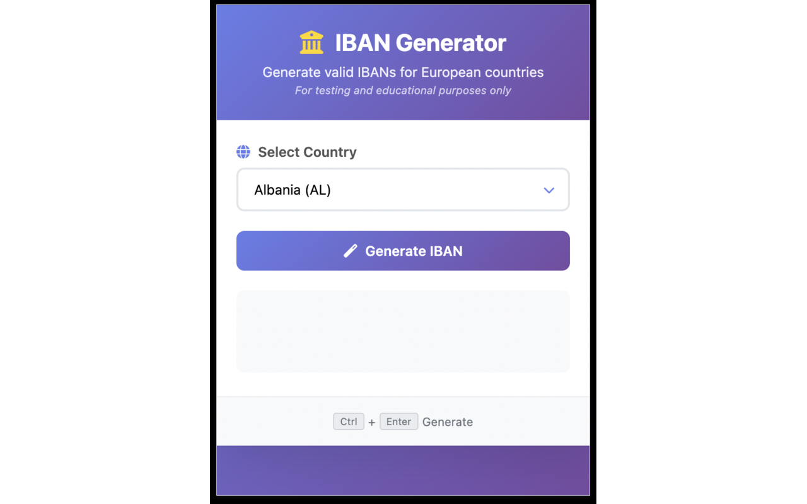
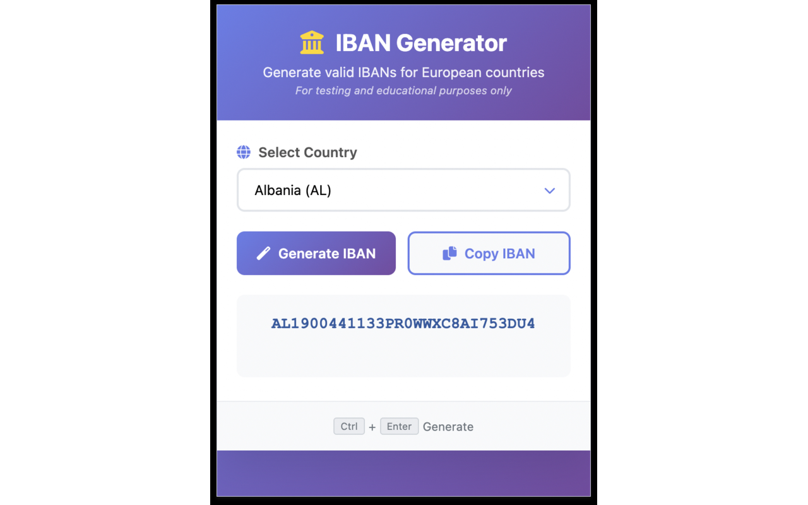

# European IBAN Generator Extension

A Chrome extension that generates valid IBANs for all European countries. Perfect for QA testing, development, and educational purposes.

---

## Features

- Complete European Coverage – supports all 44 European countries with valid IBAN formats
- Modern UI – beautiful, responsive design with smooth animations
- Manual Copy – copy generated IBANs to clipboard with a dedicated button
- Country Memory – remembers your last selected country
- Keyboard Shortcuts – use `Ctrl+Enter` to generate IBAN quickly
- Valid IBANs – all generated IBANs follow proper validation algorithms
- Offline Operation – works completely offline with no external dependencies
- Privacy Focused – no data collection, all processing local

---

## Screenshots

**Main Interface**

**After Generation**

**After Copy**

> Screenshots and preview GIF are stored in the `assets/` directory.

---

## Disclaimer

This extension is for testing and educational purposes only.

- Generated IBANs are valid in format but are not real bank accounts
- Do not use these IBANs for actual financial transactions
- Intended for QA testing, development, and educational purposes only

---

## Supported Countries

The extension supports all European countries including:

- Western Europe: France, Germany, Netherlands, Belgium, Luxembourg, Switzerland, Austria, Liechtenstein, Monaco  
- Northern Europe: Denmark, Finland, Norway, Sweden, Iceland, Faroe Islands, Greenland  
- Southern Europe: Italy, Spain, Portugal, Greece, Malta, Cyprus, San Marino, Vatican City  
- Eastern Europe: Poland, Czech Republic, Slovakia, Hungary, Romania, Bulgaria, Croatia, Slovenia, Serbia, Montenegro, Bosnia and Herzegovina, North Macedonia, Albania, Moldova, Ukraine, Belarus  
- British Isles: United Kingdom, Ireland  
- Others: Turkey, Gibraltar, Latvia, Lithuania, Estonia

---

## Installation

### Development Version

1. Clone or download this repository  
2. Open Chrome and navigate to `chrome://extensions/`  
3. Enable "Developer mode" in the top-right corner  
4. Click "Load unpacked" and select the extension folder  
5. The extension icon will appear in your browser toolbar

### Chrome Web Store (Coming Soon)

Once published, the extension will be available via the official Chrome Web Store.

---

## Usage

1. Click the extension icon in the Chrome toolbar  
2. Select a European country from the dropdown list  
3. Click "Generate IBAN" or press `Ctrl+Enter`  
4. The generated IBAN will appear and be copied to your clipboard  
5. Click "Copy IBAN" to copy it again later if needed

---

## Technical Details

- IBAN Validation: All generated IBANs comply with the ISO 13616 standard  
- Check Digit Calculation: Uses MOD-97 algorithm  
- Country-Specific BBAN: Each country uses its own BBAN structure  
- Storage: Last selected country saved using Chrome sync storage  
- Offline Operation: Works entirely in your browser, no internet needed  
- Privacy: No analytics, no telemetry, no external calls

---

## Project Structure

iban-generator-extension/
├── manifest.json              # Chrome extension configuration
├── popup.html                 # Popup interface layout
├── popup.js                   # Core JS logic and IBAN generation
├── style.css                  # UI styles and animations
├── privacy.html               # Privacy policy
├── LICENSE                    # Open-source license
├── README.md                  # This file
├── .gitignore                 # Git ignore rules
├── assets/                    # Preview GIF and screenshots
│   ├── iban-generator-preview.gif
│   ├── screenshot-1.png
│   ├── screenshot-2.png
│   └── screenshot-3.png
├── icons/                     # Extension icons for Chrome Web Store
│   ├── icon16.png
│   ├── icon32.png
│   ├── icon48.png
│   └── icon128.png
└── fontawesome/               # Local Font Awesome (self-hosted)
├── css/all.min.css
└── webfonts/

---

## Development Stack

- HTML5 – semantic and accessible markup  
- CSS3 – responsive layout with gradients and animations  
- JavaScript – modern ES6+ syntax  
- Chrome Extension APIs – for clipboard and storage functionality  
- Font Awesome – bundled locally (no CDN usage)

---

## Chrome Web Store Compliance

This extension follows all current requirements for Chrome Web Store publication:

- No CDN dependencies – all libraries are hosted locally  
- No inline styles or scripts – CSP-compliant structure  
- Offline operation – no network calls  
- Privacy-friendly – no tracking or third-party integrations  
- Includes required privacy policy and license

---

## Contributing

Pull requests, bug reports, and feature suggestions are welcome. Please create a new issue or submit a PR.

---

## License

This project is open-source under the [MIT License](./LICENSE).  
© 2025 Kirill Frantskevich. All rights reserved.